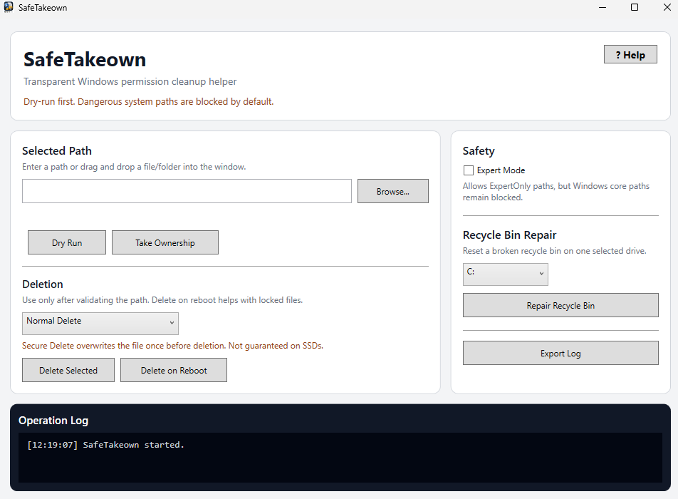

# SafeTakeown

Simple Windows permission cleanup helper.

## Screenshot UI

## Features

- Take ownership (takeown)
- Fix permissions (icacls)
- Safe delete (1-pass overwrite)
- Delete on reboot
- Recycle Bin repair
- Path safety system (HardBlocked / ExpertOnly)

## Philosophy

- No hidden actions
- No registry cleanup
- No background services
- Dry-run mindset
- Clear logs

## Warning

SafeTakeown is intended for advanced users.  
Incorrect use can damage applications or Windows installations.

## Download
[⬇ Download latest release](https://github.com/epinephren/SafeTakeown/releases/latest)
See Releases.

## Author

Epi Nephren  
https://epinephren.github.io
